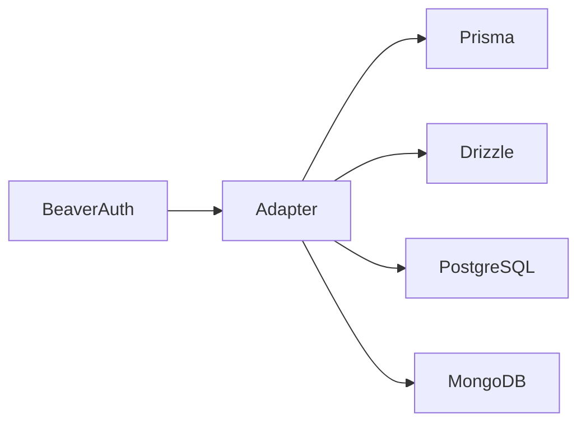
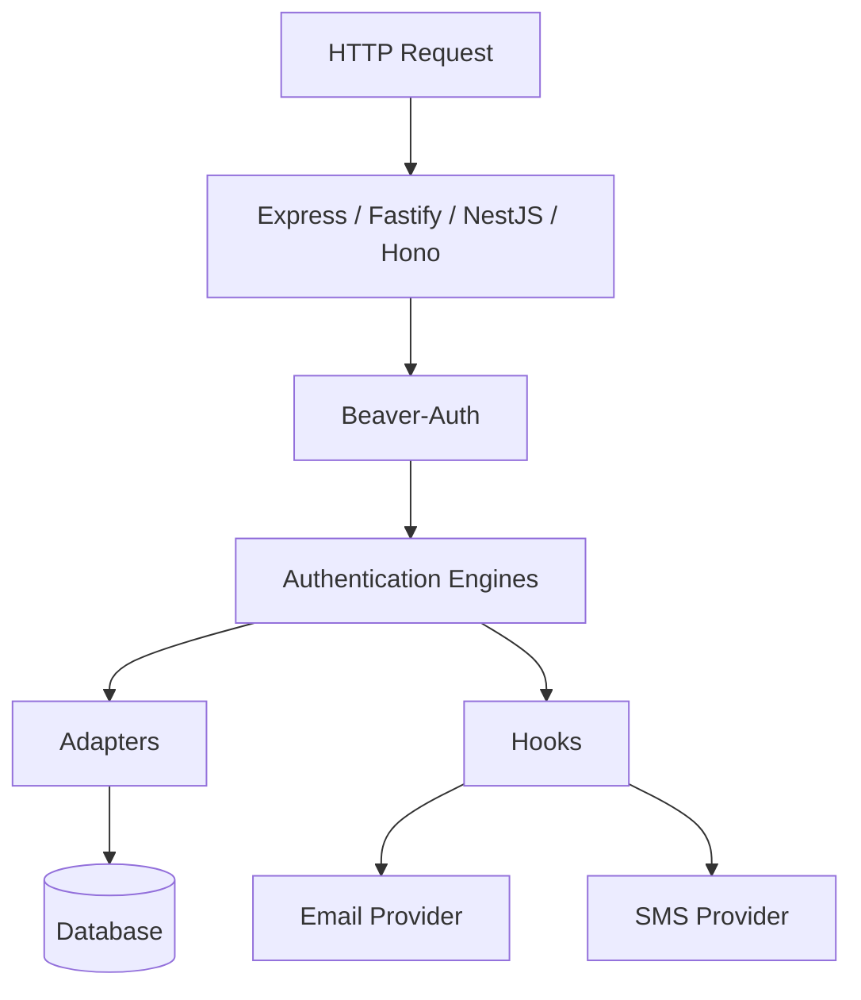

<div align="center">

# Beaver-Auth

### Framework-agnostic authentication and authorization for Node.js.

Build complete authentication systems — not authentication infrastructure.

<!-- <p>

[](https://www.npmjs.com/package/beaver-auth)
[](LICENSE)
[](https://www.npmjs.com/package/beaver-auth)

</p> -->

</div>

---

## Authentication should be a feature.

Not six weeks of engineering.

A production authentication system is far more than password hashing.

Every implementation eventually needs to coordinate:

- validation
- password hashing
- sessions
- verification
- retries
- transactions
- role management
- permissions
- rate limiting
- multi-factor authentication
- timing attack mitigation
- user enumeration protection
- token lifecycle management
- error handling

Most projects rebuild this infrastructure from scratch.

**Beaver-Auth gives you the complete workflow instead.**

---

# One line is all it takes

```ts
import { createAuth } from 'beaver-auth'

const auth = createAuth({
	adapter,
	hooks,
})

await auth.register({
	email,
	password,
	profile,
})
```

That's all you write.

Beaver-Auth coordinates everything else.

---

> [!IMPORTANT]
>
> Beaver-Auth is **not** an authentication server.
>
> It is an authentication engine.
>
> You own your application.
>
> Beaver-Auth owns the authentication workflow.

---

# Installation

```bash
npm install beaver-auth
```

or

```bash
pnpm add beaver-auth
```

or

```bash
yarn add beaver-auth
```

---

# Your framework doesn't matter

Express.

Fastify.

NestJS.

Hono.

Koa.

It doesn't matter.

Your framework simply delivers requests.

The authentication workflow never changes.

## Express

```ts
app.post('/register', async (req, res) => {
	const result = await auth.register(req.body)

	res.json(result)
})
```

## Fastify

```ts
fastify.post('/register', async (request) => {
	return auth.register(request.body)
})
```

## NestJS

```ts
@Post()
register(@Body() body: RegisterDto) {
    return this.auth.register(body)
}
```

---

# Your ORM doesn't matter either

Today you're using Prisma.

Six months later you're using Drizzle.

Next year you're writing SQL.

Beaver-Auth stays exactly the same.

Only your adapter changes.



---

# Two ways to build

## Factory API

Perfect for most applications.

```ts
import { createAuth } from 'beaver-auth'

const auth = createAuth({
	adapter,
	hooks,
})
```

---

## Engine API

Need complete control?

Instantiate only the workflow you need.

```ts
import { RegistrationEngine } from 'beaver-auth'

const registration = new RegistrationEngine({
	adapter,
	requireVerification,
})
```

Every authentication workflow is available as an independent engine.

---

# What actually happens?

Calling

```ts
await auth.register(input)
```

starts a coordinated authentication workflow.


The workflow is already built.

You only configure it.

---

# Security by default

Beaver-Auth quietly enables production security features automatically.

✅ Password hashing

✅ Timing attack mitigation

✅ Enumeration protection

✅ Verification lifecycle

✅ Token expiration

✅ Retry with exponential backoff

✅ Session abstraction

✅ Transaction support

✅ Adapter isolation

✅ Zero runtime dependencies

Security should be automatic.

Not optional.

---

# Hooks keep you in control

Beaver-Auth intentionally does **not** send emails or SMS messages.

Instead, it calls your hooks.

```mermaid
flowchart LR

Registration

--> VerificationEngine

VerificationEngine

--> Hook

Hook

--> Send Email

Hook

--> Send SMS

Hook

--> Audit Log

Hook

--> Analytics
```

Your infrastructure.

Your providers.

Your choice.

---

# Logging

Every engine accepts an optional `onSystemError` callback.

```ts
const auth = createAuth({
	adapter,
	hooks,

	onSystemError(error) {
		logger.error(error)
	},
})
```

Use:

- Pino
- Winston
- OpenTelemetry
- Sentry
- Datadog
- your own logger

Beaver-Auth never dictates your observability stack.

---

# Everything included

## Authentication

- Registration
- Login
- Logout
- Sessions
- Password recovery

## Verification

- Email verification
- Verification resend
- Magic links

## Multi-factor Authentication

- TOTP
- Email
- SMS

## Authorization

- Roles
- Permissions

## Security

- Cryptography
- Token lifecycle
- Rate limiting
- Retry engine

## Infrastructure

- Hooks
- Adapters
- Transactions
- Custom logging

---

# Architecture

Beaver-Auth sits between your framework and your infrastructure.



---

# Design Philosophy

Beaver-Auth is built around five principles.

| Principle                        | Why                                                                             |
| -------------------------------- | ------------------------------------------------------------------------------- |
| **Workflows over primitives**    | Authentication is a coordinated process — not a collection of helper functions. |
| **Composition over inheritance** | Compose engines, adapters and hooks to build the system you need.               |
| **Framework independence**       | Your authentication shouldn't depend on Express, NestJS or Fastify.             |
| **Explicit over magic**          | No decorators. No hidden behavior. No code generation.                          |
| **Secure defaults**              | The safest implementation should also be the easiest implementation.            |

---

# What Beaver-Auth doesn't do

To stay framework and infrastructure agnostic, Beaver-Auth intentionally does **not**:

- create database tables
- generate ORM models
- own your HTTP layer
- send emails
- send SMS messages
- dictate your folder structure
- manage your infrastructure

Instead, you connect Beaver-Auth to your application through adapters and hooks.

---

# Documentation

Whether you're getting started or exploring advanced customization, the documentation is organized to help you move from installation to production.

## Getting Started

- Installation
- Quick Start
- Core Concepts
- Architecture

## Guides

- Registration
- Login
- Sessions
- Verification
- Multi-factor Authentication
- OAuth
- Authorization
- Tokens
- Cryptography
- Rate Limiting

## Advanced

- Adapters
- Hooks
- Transactions
- Error Handling
- API Reference

---

# Roadmap

## Version 1

- ✅ Registration
- ✅ Login
- ✅ Sessions
- ✅ Email Verification
- ✅ OAuth
- ✅ MFA
- ✅ Tokens
- ✅ Cryptography
- ✅ Rate Limiting

### Planned

- WebAuthn / Passkeys
- Device Management
- Session Dashboard
- ABAC Authorization

---

# Contributing

Contributions, ideas and feedback are welcome.

If you'd like to improve Beaver-Auth, please open an issue or submit a pull request.

---

# License

MIT
